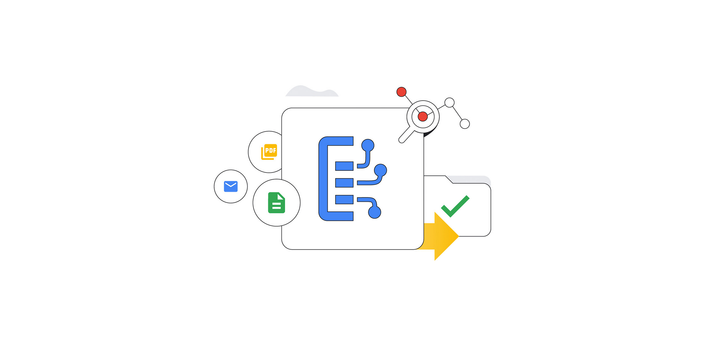
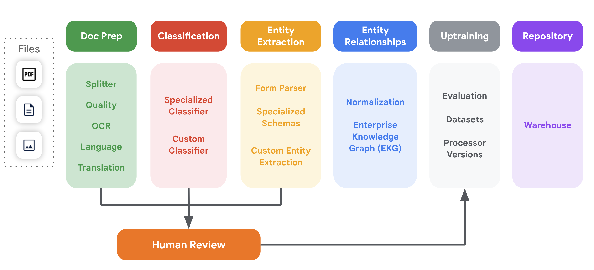

# Unleash Document AI's Power with Custom & Built-in Processors (Python)
This guide serves as your hands-on introduction to unleashing the power of Google Cloud's Document AI using Python. We'll delve into both custom and built-in processors, showcasing their capabilities and guiding you through their implementation.



Using Document AI, you can:

* Pre-process documents with image quality detection and deskewing
* Extract text and layout information from document files
* Identify key-value pairs in structured forms
* Split and classify documents by type
* Extract and normalize entities
* Label and review documents
* Store, search, organize, govern, and analyze documents and metadata


This diagram illustrates all of the key document processing steps that are supported by Document AI and how they can connect to each other.




## What are Processors?
A Document AI processor is an interface between the document file and a machine learning model that performs document processing actions. They can be used to to classify, split, parse or analyze a document.

Each Google Cloud project needs to create its own processor instances.

Processors fit into one of the following categories:

* **General** - Pre-built processors for compatibility with most documents
* **Specialized** - Pre-built processors for specific document types
    - [Procurement](https://cloud.google.com/solutions/procurement-doc-ai) - Documents used for purchases and payments, such as invoices and receipts
    - [Identity](https://cloud.google.com/solutions/identity-doc-ai) - Documents used for identity verification
    - [Lending](https://cloud.google.com/solutions/lending-doc-ai) - Documents used for mortgage loans
    - [Contract](https://cloud.google.com/solutions/contract-doc-ai) - Extract and understand entities from business contracts
* **Custom** - User-created processors for custom documents and use cases

Within each category, there are multiple processor types. Each type is designed for a specific task such as [Optical Character Recognition (OCR)](https://en.wikipedia.org/wiki/Optical_character_recognition), form parsing, splitting, [classification](https://en.wikipedia.org/wiki/Document_classification) or [entity extraction](https://en.wikipedia.org/wiki/Named-entity_recognition) for specific document types.

Refer to the [Full processor and detail list](https://cloud.google.com/document-ai/docs/processors-list) for information about all available processor types for Document AI.

## Prerequisites:
* Basic understanding of Python
* Google Cloud Project with Document AI API enabled
* Downloaded Service Account in JSON
* Python dependencies: `google-cloud-documentai`

### Installation
Follow the steps below to set up and run the code generation app:

#### 1. Clone the Repository

```bash
git clone https://github.com/ridwanspace/document-ai-notebook.git
cd document-ai-notebook
```

#### 2. Install Dependencies
```bash
pip install -r requirements.txt
```

#### 3. Put Google Cloud Project's Service Account (JSON) into root folder

#### 4. Create `env` file and pass following variables
```bash
PROJECT_ID = xxxxx
REGION = xxxxx
IDN_CARD_PROCESSOR_ID = xxxx
IDN_DRIVING_LICENSE_PROCESSOR_ID = xxxx
```


### Cost
- Check this Document AI [pricing](https://cloud.google.com/document-ai/pricing)

### Referene
1. [Official documentation](https://cloud.google.com/document-ai/docs/overview)
2. [GitHub Repos](https://github.com/GoogleCloudPlatform/document-ai-samples)

